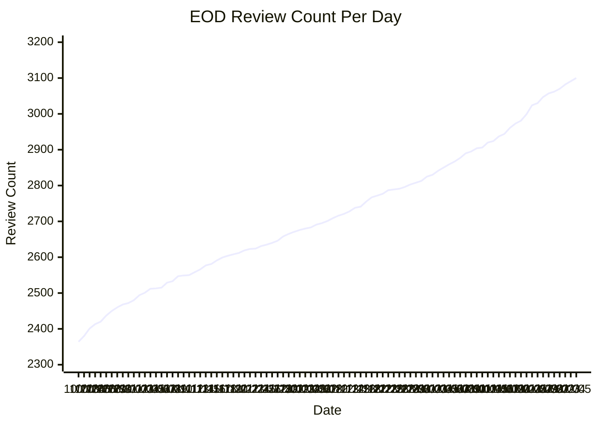

# Steps Review Monitor

Tracks the App Store review count for [Steps - Simple Pedometer](https://apps.apple.com/us/app/steps-simple-pedometer/id1602546738) via a GitHub Actions cron job (every 5 minutes). When the count increases, it commits the new value and opens a GitHub Issue.

## EOD Review Count

