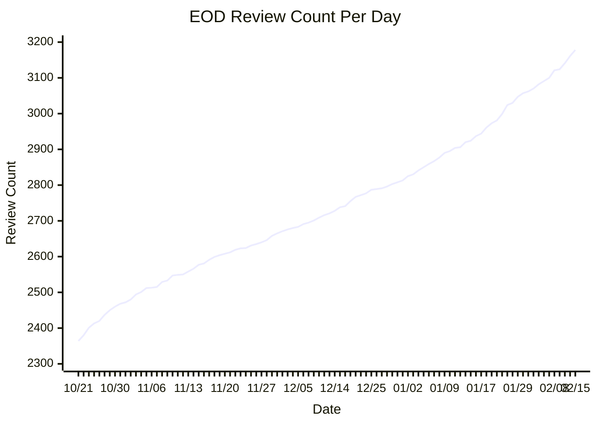

# Steps Review Monitor

Tracks the App Store review count for [Steps - Simple Pedometer](https://apps.apple.com/us/app/steps-simple-pedometer/id1602546738) via a GitHub Actions cron job (every 5 minutes). When the count increases, it commits the new value and opens a GitHub Issue.

**Current count: 3178** (as of 2026-02-15)

## EOD Review Count

## Rate Statistics

Last 7d averaged **8.1/day** vs **7.9/day** prior 7d (+3.6%) — **not statistically significant** (z = 0.15)

Current 7d rate sits at the **69th percentile** of all daily rates (z = 0.9 vs all-time mean of 7.0/day)

### Daily Rate Distribution

| Period | Mean/day | Median/day | Std Dev | Min | Max | N days |
|--------|----------|------------|---------|-----|-----|--------|
| 7d | 8.1 | 5.7 | 4.3 | 3.0 | 17.0 | 7 |
| 14d | 8.0 | 7.0 | 3.5 | 3.0 | 17.0 | 14 |
| 30d | 8.0 | 8.5 | 3.2 | 3.0 | 17.0 | 30 |
| all-time | 7.0 | 7.0 | 3.5 | 1.0 | 21.0 | 117 |

### Acceleration Tests

| Window | Recent avg | Prior avg | Change | Std Dev (R) | Std Dev (P) | z-score | Significant? |
|--------|-----------|-----------|--------|-------------|-------------|---------|--------------|
| 7d vs prior 7d | 8.1 | 7.9 | +3.6% | 4.3 | 2.3 | 0.15 | not significant |
| 14d vs prior 14d | 8.0 | 8.1 | -1.3% | 3.5 | 3.1 | -0.09 | not significant |

> **Reading the stats:** z-score measures how many standard errors the recent mean is from the prior mean. |z| > 1.96 → significant at 95% confidence (p < 0.05). High std dev relative to the mean suggests noisy data where apparent trends may just be normal variance.

## Weekly Breakdown

| Week | Dates | +Reviews | Avg/day |
|------|-------|----------|---------|
| 2025-W43 | 2025-10-21 to 2025-10-26 | +56 | 9.3 |
| 2025-W44 | 2025-10-28 to 2025-11-02 | +60 | 10.0 |
| 2025-W45 | 2025-11-03 to 2025-11-09 | +53 | 7.6 |
| 2025-W46 | 2025-11-10 to 2025-11-16 | +48 | 6.9 |
| 2025-W47 | 2025-11-17 to 2025-11-23 | +42 | 6.0 |
| 2025-W48 | 2025-11-24 to 2025-11-30 | +35 | 5.0 |
| 2025-W49 | 2025-12-01 to 2025-12-07 | +37 | 5.3 |
| 2025-W50 | 2025-12-08 to 2025-12-14 | +33 | 4.7 |
| 2025-W51 | 2025-12-15 to 2025-12-21 | +39 | 5.6 |
| 2025-W52 | 2025-12-22 to 2025-12-28 | +29 | 4.1 |
| 2026-W01 | 2025-12-29 to 2026-01-04 | +45 | 6.4 |
| 2026-W02 | 2026-01-05 to 2026-01-11 | +63 | 9.0 |
| 2026-W03 | 2026-01-12 to 2026-01-17 | +40 | 6.7 |
| 2026-W04 | 2026-01-19 to 2026-01-25 | +80 | 11.4 |
| 2026-W05 | 2026-01-27 to 2026-01-31 | +38 | 7.6 |
| 2026-W06 | 2026-02-02 to 2026-02-08 | +59 | 8.4 |
| 2026-W07 | 2026-02-09 to 2026-02-15 | +57 | 8.1 |

---
*Auto-generated by `scripts/generate_readme.py` — updated twice daily via GitHub Actions.*
